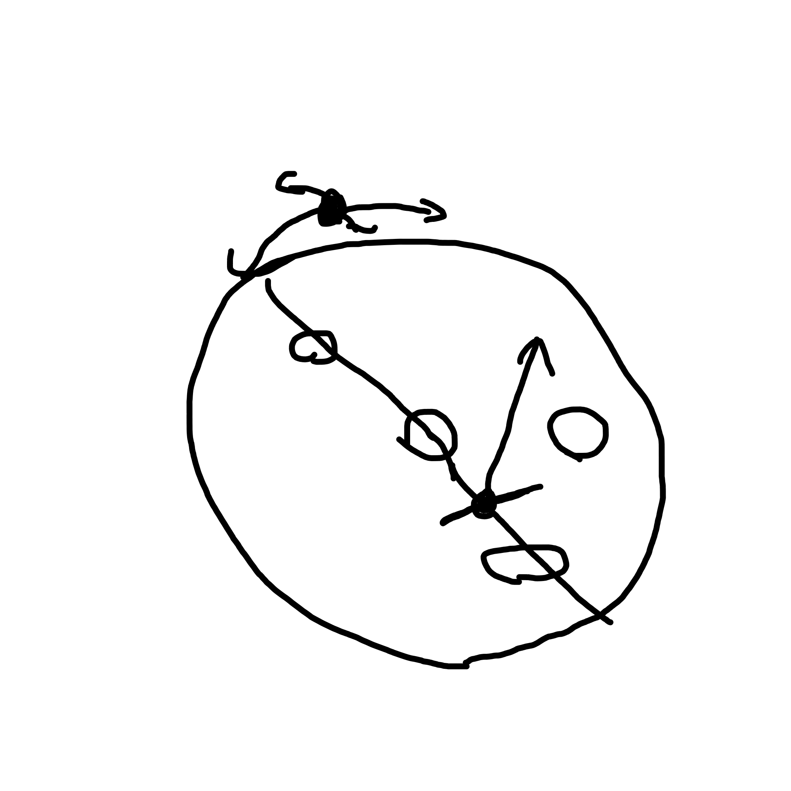

# 10Daysのゲーム制作 草案  

### **今回のお題 「並べる」**  
**参照** [10Days資料](https://docs.google.com/presentation/d/144mvEadvFZilYqrs_Ig4J3wDZCszXNYST8nOJ3RQyEQ/preview?slide=id.g125511afdd4_1_55)
> (略) RPGやシミュレーションなどの隊列やパズルのルールなど、様々な並びがある  

---  

### **要点**  
1. **並べるという要素が感じやすいこと**  

2. **製作にするにあたり、製作期間中に作り切れること**  

---  

### **現状上がっている案**
1. **オブジェクト(敵)を撃って、動かして撃破するゲーム**
> メリット 「シューティングを発展させた形で展開でき、3Dの良さを立体的に表現できるのがいい」  
>> デメリット 「ステージのデザインが難しい。敵の数を増やさなくてはならない」  
2. **攻撃手段や射程などを分けた自機を、切り替えながら戦う**  
> メリット 「草案1と同じく、シューティングを発展させた形で展開できる。」  
>> デメリット 「並べるという要素が感じづらい。お題とかけ離れている」  

---  

### **採用案**  
**タイトル 「貫け」**
> プレイヤーが円状(天球)に動いて、向いている方向に飛び(※もしくは、弾を飛ばす)、間にいる敵を倒す
>> 並んでいる敵を、飛べる回数が決められている中で、どれだけ倒せるか

<!----->

---  

### **オブジェクト案**
1. 動かない壁  
2. 反射する壁  
3. 動く壁
4. 一定間隔で出現を繰り返す壁
5. 当たったらゲームオーバーになる(外・中に置いておく)
6. 当たったら分裂する(弾を散らかす・プレイヤーが分かれる等)

---

### **ステージ案**